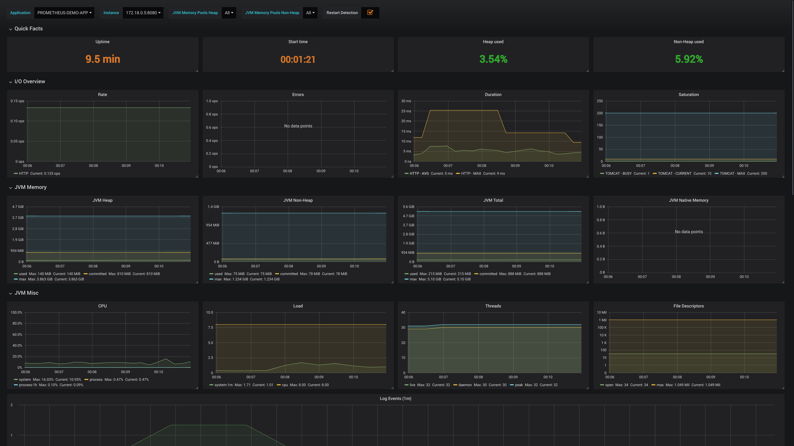

# Prometheus with Spring Boot using service discovery via Eureka

Prometheus doesn't natively support Eureka as a service discovery mechanism.

This is a demo of adapting Eureka to support Prometheus, and example of scraping a relabelling configuration.

Uses [Eureka Consul Exporter](https://github.com/twinformatics/eureka-consul-adapter) 
to expose Eureka metadata via Consul apis and using Consul metadata.

Prometheus can then use the native Consul support to discovery targets.

To build use: `mvn clean install`

Then `docker-compose up` to bring up

* Prometheus (port 9090)
* Grafana (port 3000)
* Blackbox Exporter (port 9115)
* Eureka (port 8761)
* Spring Boot Demo app registered with Eureka (port 8080)

Go to [Grafana Dashboard](http://localhost:3000/d/n9TP6fNmk/jvm-micrometer?refresh=5s&orgId=1&from=now-15m&to=now&var-application=PROMETHEUS-DEMO-APP)

to see a dashboard with the currently discovered applications. (allow a minute of two for some data to be collected)

(username/password is admin/admin)

Dashboard taken from https://grafana.com/dashboards/4701

